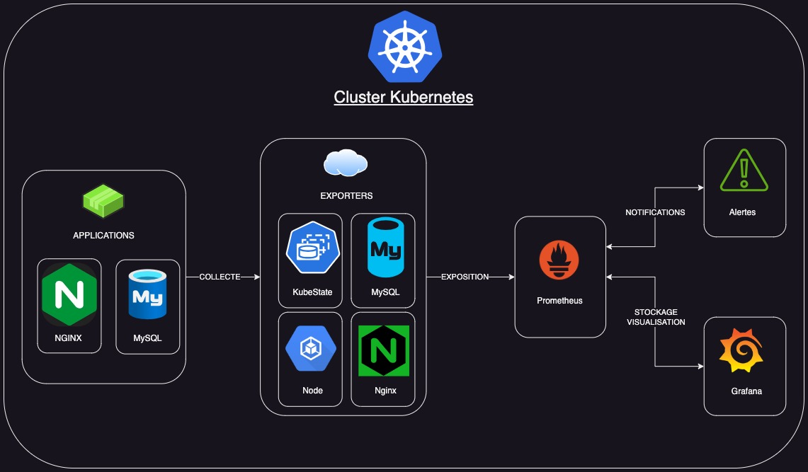
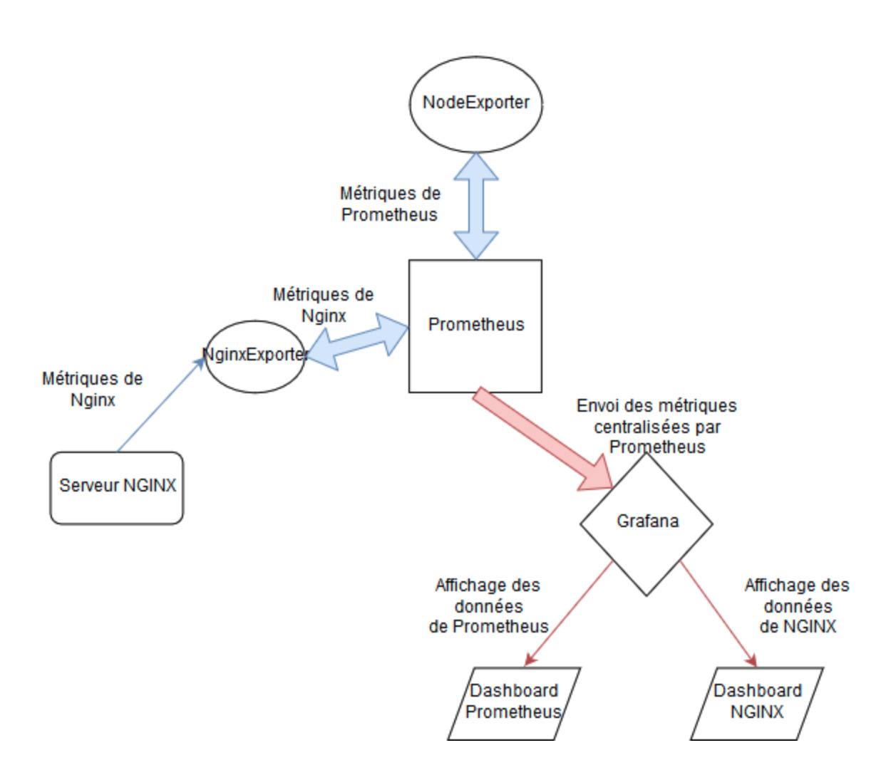

# TP6_monitoring

Documentation de la Solution de Supervision Kubernetes

## 1- Présentation:

Cette documentation décrit la mise en place d'une solution de supervision centralisée pour surveiller un cluster Kubernetes et les applications qu'il contient. La solution utilise Prometheus pour la collecte de métriques, Grafana pour la visualisation des tableaux de bord et les Exporters nécessaires pour récupérer les métriques des différentes composantes du cluster et des applications.

## 2- Arborescence des Fichiers

```shell
. # Arborescence du repository
├── README.md
├── alerts
│   ├── alert.rules
│   └── kube-node-cpu-alerts.yaml
├── exporter
│   ├── kube-state-metrics-deployment.yaml
│   ├── kube-state-metrics-service.yaml
│   ├── mysql-exporter-deployment.yaml
│   ├── mysql-exporter-service.yaml
│   ├── nginx-exporter-deployment.yaml
│   ├── nginx-exporter-service.yaml
│   ├── node-exporter-deployment.yaml
│   └── node-exporter-service.yaml
├── grafana
│   ├── grafana-deployment.yaml
│   └── grafana-service.yaml
├── mysql
│   ├── mysql-deployment.yaml
│   └── mysql-service.yaml
├── nginx
│   ├── nginx-deployment.yaml
│   └── nginx-service.yaml
├── prometheus
│   ├── prometheus-deployment.yaml
│   └── prometheus-service.yaml
├── schema
│   ├── supervision-app-exporters.jpg
│   ├── supervision-app.drawio
│   ├── supervision-app.drawio.pdf
│   └── supervision-app.jpg
└── tp_6_monitoring.pdf

7 directories, 24 files

```

Cette arborescence représente la structure d'un projet avec plusieurs dossiers et fichiers. Voici une explication simple de chaque partie :

1. README.md: Fichier de documentation expliquant le projet.

2. alerts/

   1. alert.rules: Fichier contenant les règles d'alerte Prometheus pour la surveillance.
   2. kube-node-cpu-alerts.yaml: Fichier YAML définissant des alertes spécifiques pour la CPU des nœuds Kubernetes.

3. exporter/
   Fichiers YAML définissant le déploiement et le service Kubernetes pour différents exportateurs (kube-state-metrics, MySQL, Nginx, Node

4. grafana/
   Fichiers YAML définissant le déploiement et le service Kubernetes pour Grafana.

5. mysql/
   Fichiers YAML définissant le déploiement et le service Kubernetes pour MySQL.

6. nginx/
   Fichiers YAML définissant le déploiement et le service Kubernetes pour Nginx.

7. prometheus/
   Fichiers YAML définissant le déploiement et le service Kubernetes pour Prometheus.

8. schema/
   Fichiers graphiques (JPG, drawio, PDF) décrivant le schéma de surveillance de l'application.

9. tp_6_monitoring.pdf: Document PDF lié au TP 6 sur le monitoring.

Le projet est organisé de manière à regrouper les fichiers en fonction de leur fonctionnalité (déploiement, exportateurs, outils de surveillance, etc.).

## 3- Prérequis :

Avant de déployer la solution de supervision, assurez-vous que :

- Le cluster Kubernetes est déjà déployé et prêt à recevoir de nouveaux déploiements.
- Vous disposez d'un accès administrateur pour créer des Déploiements, Services et ConfigMaps dans le cluster.

## 4- Architecture :

Architecture globale:


Focus sur fonctionnement des exporters:


## 5- Déploiement :

Pour déployer la solution de supervision, suivez les étapes ci-dessous :

### a- Déployez les applications de démonstration (Nginx et MySQL) :

```bash
  - kubectl apply -f nginx/
#   - kubectl apply -f mysql
```

### b- Déployez Prometheus, Grafana et les Exporters :

```bash
  - kubectl apply -f exporters/
  - kubectl apply -f prometheus/
  - kubectl apply -f grafana/
```

## 6- Métriques Importantes :

Les métriques collectées sont liées aux quatre Signaux d'Or :

- Latence
- Utilisation CPU
- Utilisation Mémoire
- Saturation des Ressources

Les métriques collectées incluent celles provenant de Node Exporter, Kube State Metrics Exporter, Nginx Exporter, MySQL Exporter, etc.

## 7- Utilisation des Tableaux de Bord :

Pour utiliser les tableaux de bord fournis avec Grafana :

- Déployez les fichiers JSON des tableaux de bord via l'interface Grafana.
- Explorez les tableaux de bord pour surveiller les différentes composantes du cluster et des applications.

## 8- Alertes :

Les alertes Prometheus sont définies dans les fichiers YAML du dossier alerts/. Les alertes importantes ont été configurées pour les métriques critiques, comme la haute utilisation CPU sur les nœuds Kubernetes.

## 9- Ajouter de nouvelles Métriques :

Pour ajouter des métriques d'une nouvelle application à superviser :

- Déployez l'Exporter Prometheus approprié pour la nouvelle application.
- Sélectionner les métriques importantes de cette application.
- Créez des tableaux de bord Grafana pour visualiser ces métriques.

## Conclusion :

La solution de supervision est maintenant déployée et configurée avec Prometheus pour la collecte de métriques, Grafana pour la visualisation des tableaux de bord et les Exporters pour récupérer les métriques des différentes composantes du cluster Kubernetes et des applications. Utilisez les tableaux de bord et les alertes pour surveiller la santé de votre infrastructure Kubernetes et des applications déployées.

https://scribehow.com/shared/Create_a_new_alert_rule_with_a_15_minute_evaluation_interval_Copy__Bgxvgmh2Qq2pvrBa5LTOQw

https://scribehow.com/shared/Creating_a_Dashboard_and_Monitoring_Nginx_with_Prometheus__eMITCaMwRwS8G_OUr4LlHw
